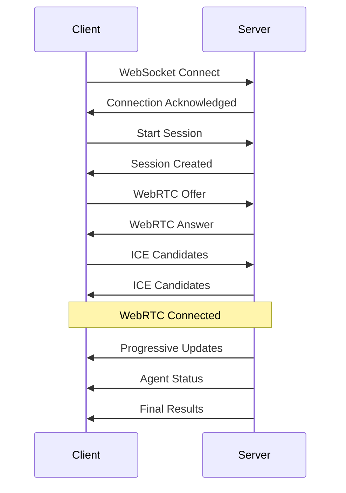

# WebSocket Protocol Specification

## Connection Endpoint
`ws://localhost:8000/ws/stream`

## Message Types

### Client → Server Messages

#### 1. WebRTC Offer
```json
{
  "type": "offer",
  "sdp": "v=0\r\no=- ...",
  "session_id": "uuid-here"
}
```

#### 2. ICE Candidate
```json
{
  "type": "ice_candidate",
  "candidate": {
    "candidate": "candidate:...",
    "sdpMLineIndex": 0,
    "sdpMid": "0"
  },
  "session_id": "uuid-here"
}
```

#### 3. Start Session
```json
{
  "type": "start_session",
  "mode": "automatic",
  "camera_config": {
    "source": "webcam",
    "resolution": "640x480",
    "fps": 30
  }
}
```

#### 4. Stop Session
```json
{
  "type": "stop_session",
  "session_id": "uuid-here"
}
```

#### 5. Manual Trigger
```json
{
  "type": "manual_trigger",
  "session_id": "uuid-here",
  "agent": "initial_classifier"
}
```

#### 6. Mode Switch
```json
{
  "type": "switch_mode",
  "session_id": "uuid-here",
  "mode": "manual"
}
```

#### 7. Export Request
```json
{
  "type": "export_results",
  "session_id": "uuid-here",
  "format": "json"
}
```

### Server → Client Messages

#### 1. WebRTC Answer
```json
{
  "type": "answer",
  "sdp": "v=0\r\no=- ...",
  "session_id": "uuid-here"
}
```

#### 2. Session Created
```json
{
  "type": "session_created",
  "session_id": "uuid-here",
  "mode": "automatic",
  "status": "initializing"
}
```

#### 3. Progressive Update
```json
{
  "type": "progressive_update",
  "session_id": "uuid-here",
  "agent": "initial_classifier",
  "timestamp": "2025-01-10T10:00:05Z",
  "attributes": {
    "type": "shirt",
    "color": "blue",
    "pattern": "striped"
  },
  "confidence": 0.92,
  "frames_processed": 5
}
```

#### 4. Agent Started
```json
{
  "type": "agent_started",
  "session_id": "uuid-here",
  "agent": "initial_classifier",
  "timer_seconds": 4,
  "mode": "automatic"
}
```

#### 5. Agent Completed
```json
{
  "type": "agent_completed",
  "session_id": "uuid-here",
  "agent": "initial_classifier",
  "results": {
    "type": "shirt",
    "color": "blue and white",
    "pattern": "striped",
    "neckline": "round neck",
    "sleeves": "long sleeves",
    "closure": "buttons"
  },
  "reasoning": "Item has long sleeves and collar...",
  "frames_analyzed": 12
}
```

#### 6. Final Results
```json
{
  "type": "final_results",
  "session_id": "uuid-here",
  "classification": {
    "type": "shirt",
    "color_primary": "blue",
    "color_secondary": "white",
    "pattern": "striped",
    "brand": "Nike",
    "size": "L",
    "has_damage": false
  },
  "processing_time": 14.5,
  "total_frames": 45,
  "confidence_overall": 0.95
}
```

#### 7. Status Update
```json
{
  "type": "status_update",
  "session_id": "uuid-here",
  "current_agent": "damage_detector",
  "progress": 75,
  "timer_remaining": 2.5,
  "fps": 28.5,
  "gpu_usage": 45,
  "connection_quality": "excellent"
}
```

#### 8. Error Message
```json
{
  "type": "error",
  "session_id": "uuid-here",
  "error_code": "CAMERA_DISCONNECTED",
  "message": "Camera connection lost",
  "recoverable": true,
  "suggested_action": "reconnect"
}
```

#### 9. Export Ready
```json
{
  "type": "export_ready",
  "session_id": "uuid-here",
  "download_url": "/api/session/uuid-here/export",
  "format": "json",
  "size_bytes": 4096
}
```

## WebRTC Data Channel Messages

### Channel Name: `results`

#### Progressive Attribute Update
```json
{
  "type": "attribute",
  "agent": "initial_classifier",
  "attribute": "type",
  "value": "shirt",
  "confidence": 0.89,
  "frame_number": 5
}
```

#### Frame Processing Status
```json
{
  "type": "frame_status",
  "frame_id": "frame-uuid",
  "status": "processing",
  "agent": "detail_extractor"
}
```

#### System Metrics
```json
{
  "type": "metrics",
  "fps_stream": 30,
  "fps_processing": 3,
  "queue_size": 5,
  "latency_ms": 45
}
```

## Connection Flow



## Error Codes

| Code | Description | Recoverable |
|------|-------------|-------------|
| CAMERA_DISCONNECTED | Camera connection lost | Yes |
| MODEL_LOAD_FAILED | VLM failed to load | Yes |
| GPU_MEMORY_EXCEEDED | Out of GPU memory | No |
| SESSION_NOT_FOUND | Invalid session ID | No |
| INVALID_MODE | Invalid mode specified | Yes |
| AGENT_TIMEOUT | Agent processing timeout | Yes |
| WEBRTC_FAILED | WebRTC connection failed | Yes |

## Reconnection Protocol

1. Client detects disconnection
2. Client attempts reconnect with session_id
3. Server checks if session is resumable (manual mode only)
4. If resumable: Server sends last checkpoint
5. If not resumable: Server creates new session
6. Client resumes or restarts accordingly