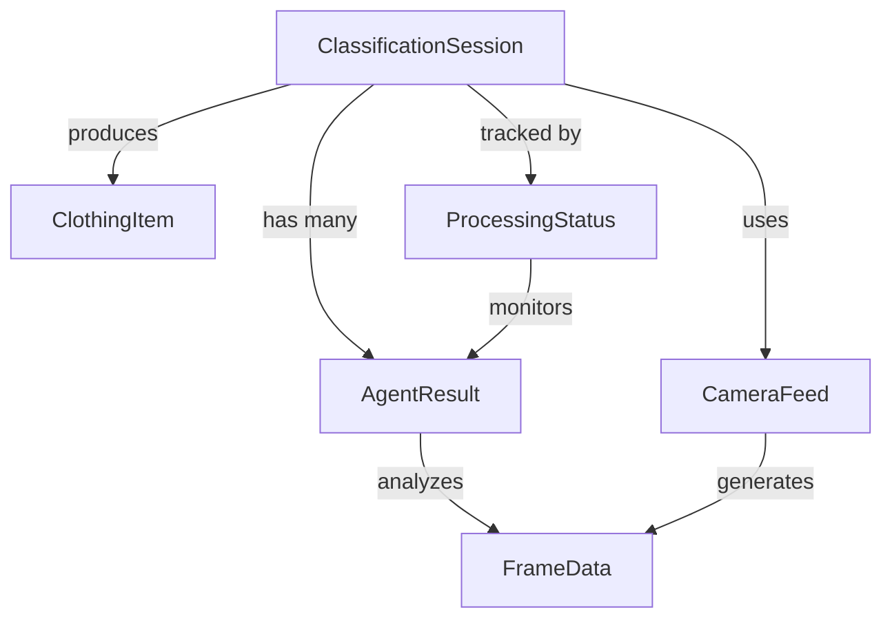

# Data Model: Intelligent Returns Classifier System

## Core Entities

### ClothingItem
Represents a returned clothing item being classified.

```python
class ClothingItem:
    # Identification
    item_id: str  # UUID for this specific item
    session_id: str  # Reference to classification session
    
    # Classification Attributes
    type: Optional[str]  # shirt, pants, dress, jacket, etc.
    color_primary: Optional[str]  # Main color detected
    color_secondary: Optional[str]  # Secondary color if multi-colored
    pattern: Optional[str]  # solid, striped, checkered, floral, etc.
    
    # Physical Attributes
    neckline: Optional[str]  # v-neck, round, crew, etc.
    sleeves: Optional[str]  # long, short, sleeveless, etc.
    closure: Optional[str]  # buttons, zip, buckle, etc.
    
    # Brand & Size
    brand: Optional[str]  # Detected brand name or null
    size: Optional[str]  # Size tag reading or null
    
    # Condition
    has_damage: bool = False
    damage_type: Optional[str]  # tear, stain, fade, hole, etc.
    damage_locations: List[str] = []  # Specific damage locations
    
    # Metadata
    created_at: datetime
    updated_at: datetime
    final_confidence: float  # Overall confidence score
```

### ClassificationSession
Represents one complete classification cycle through all agents.

```python
class ClassificationSession:
    # Identification
    session_id: str  # UUID for this session
    apparel_id: str  # Same as session_id for tracking
    
    # Session Configuration
    mode: str  # 'automatic' or 'manual'
    camera_source: str  # Camera identifier/type
    
    # Timing
    started_at: datetime
    completed_at: Optional[datetime]
    total_duration_seconds: Optional[float]
    
    # Status
    status: str  # 'initializing', 'processing', 'completed', 'error', 'interrupted'
    current_agent: Optional[str]  # Name of currently active agent
    progress_percentage: int  # 0-100
    
    # Results
    agent_results: List[AgentResult]  # Individual agent outputs
    final_classification: Optional[ClothingItem]  # Consolidated result
    
    # Frame Processing
    total_frames_analyzed: int = 0
    frames_per_agent: Dict[str, int] = {}
    
    # Recovery (Manual Mode Only)
    is_resumable: bool  # True if manual mode and interrupted
    last_checkpoint: Optional[dict]  # State for resumption
```

### AgentResult
Individual analysis output from each specialized agent.

```python
class AgentResult:
    # Identification
    agent_name: str  # initial_classifier, detail_extractor, etc.
    session_id: str  # Reference to session
    
    # Timing
    started_at: datetime
    completed_at: datetime
    processing_time_seconds: float
    
    # Configuration
    timer_seconds: Optional[float]  # Timer duration in auto mode
    trigger_type: str  # 'automatic' or 'manual'
    
    # Results
    detected_attributes: dict  # Agent-specific attributes
    confidence_scores: Dict[str, float]  # Per-attribute confidence
    reasoning: str  # Explanation of detection logic
    
    # Frame Data
    frames_processed: int
    last_frame_id: str  # Reference to analyzed frame
    
    # Progressive Updates
    partial_results: List[dict]  # Intermediate results during processing
    update_timestamps: List[datetime]  # When updates were sent
```

### CameraFeed
Live video stream configuration and status.

```python
class CameraFeed:
    # Identification
    camera_id: str
    camera_type: str  # 'realsense', 'zebra_cv60', 'webcam', 'builtin'
    
    # Configuration
    resolution_width: int = 640
    resolution_height: int = 480
    fps: int = 30
    backend: str  # OpenCV backend being used
    
    # Connection
    connection_status: str  # 'connected', 'disconnected', 'reconnecting'
    webrtc_peer_id: Optional[str]  # WebRTC peer connection ID
    
    # Stream Metrics
    frames_captured: int = 0
    frames_dropped: int = 0
    current_fps: float = 0.0
    bandwidth_mbps: float = 0.0
    
    # Health
    last_frame_timestamp: Optional[datetime]
    connection_quality: str  # 'excellent', 'good', 'poor'
    error_count: int = 0
    last_error: Optional[str]
```

### ProcessingStatus
Real-time status of the classification pipeline.

```python
class ProcessingStatus:
    # Current State
    session_id: str
    current_agent: str  # Name of active agent
    agent_status: str  # 'waiting', 'processing', 'completed'
    
    # Timing
    agent_timer_remaining: float  # Seconds left in auto mode
    pipeline_elapsed_time: float  # Total time since start
    estimated_completion: datetime  # Predicted finish time
    
    # Progress
    agents_completed: List[str]
    agents_pending: List[str]
    overall_progress: int  # 0-100 percentage
    
    # Frame Processing
    current_frame_id: str
    frames_in_queue: int
    processing_fps: float  # Actual processing rate
    
    # System Resources
    gpu_usage_percent: float
    gpu_memory_mb: int
    cpu_usage_percent: float
    memory_usage_mb: int
```

### FrameData
Individual frame extracted from video stream.

```python
class FrameData:
    # Identification
    frame_id: str  # UUID
    session_id: str
    
    # Frame Info
    timestamp: datetime
    sequence_number: int  # Frame number in stream
    
    # Image Data
    width: int
    height: int
    format: str  # 'RGB', 'BGR', etc.
    image_data: bytes  # Raw frame data (deleted after processing)
    
    # Processing
    processed: bool = False
    processing_agent: Optional[str]
    processing_started: Optional[datetime]
    processing_completed: Optional[datetime]
    
    # Auto-deletion
    marked_for_deletion: bool = False
    deletion_scheduled: Optional[datetime]
```

## Relationships



## State Transitions

### Session Status Flow
```
initializing -> processing -> completed
                    ↓
                interrupted (manual mode only)
                    ↓
                processing (resumed)
```

### Agent Status Flow
```
waiting -> processing -> completed
              ↓
           error (retry or skip)
```

### Camera Connection Flow
```
disconnected -> connecting -> connected
                    ↓            ↓
              connection_failed  disconnected
                    ↓            ↓
                 retry      reconnecting
```

## Validation Rules

### ClothingItem
- `type` must be from predefined list: [shirt, pants, dress, jacket, skirt, sweater, coat]
- `size` can be null or standard sizes: [XS, S, M, L, XL, XXL] or numeric
- `brand` can be null or non-empty string
- `damage_type` only set if `has_damage` is true
- All Optional fields default to null if unreadable

### ClassificationSession
- `session_id` must be valid UUID
- `mode` must be 'automatic' or 'manual'
- `status` transitions must follow defined flow
- `is_resumable` only true if mode='manual' and status='interrupted'
- `completed_at` only set when status='completed'

### AgentResult  
- `agent_name` must match registered agent
- `confidence_scores` values between 0.0 and 1.0
- `processing_time_seconds` must be positive
- `frames_processed` must be >= 1

### CameraFeed
- `resolution_width` and `resolution_height` must be positive
- `fps` between 1 and 60
- `connection_quality` derived from fps and bandwidth
- `camera_type` from supported list

### ProcessingStatus
- `overall_progress` calculated from agents completed/total
- `agent_timer_remaining` only in automatic mode
- Resource usage percentages between 0 and 100

## Data Persistence

### Session Logs (JSON Format)
```json
{
  "session_id": "uuid-here",
  "mode": "automatic",
  "started_at": "2025-01-10T10:00:00Z",
  "completed_at": "2025-01-10T10:00:15Z",
  "final_classification": {
    "type": "shirt",
    "color_primary": "blue",
    "brand": "Nike",
    "size": "L",
    "has_damage": false
  },
  "agent_results": [...],
  "total_frames_analyzed": 45
}
```

### Progressive Update Format (WebRTC Data Channel)
```json
{
  "type": "progressive_update",
  "session_id": "uuid-here",
  "agent": "initial_classifier",
  "timestamp": "2025-01-10T10:00:05Z",
  "attributes": {
    "type": "shirt",
    "confidence": 0.92
  }
}
```

## Performance Considerations

- **In-Memory Storage**: All active session data kept in memory
- **Frame Deletion**: Automatic cleanup after processing
- **Result Streaming**: Progressive updates via data channel
- **Session Cleanup**: Automatic on application restart
- **Manual Mode Recovery**: Session state persisted to JSON

## Security & Privacy

- **No Permanent Video Storage**: Frames deleted immediately after processing
- **Local Processing Only**: No external API calls
- **Session Isolation**: Each session has unique UUID
- **No User Authentication**: System is open access
- **Audit Trail**: JSON logs for completed sessions only