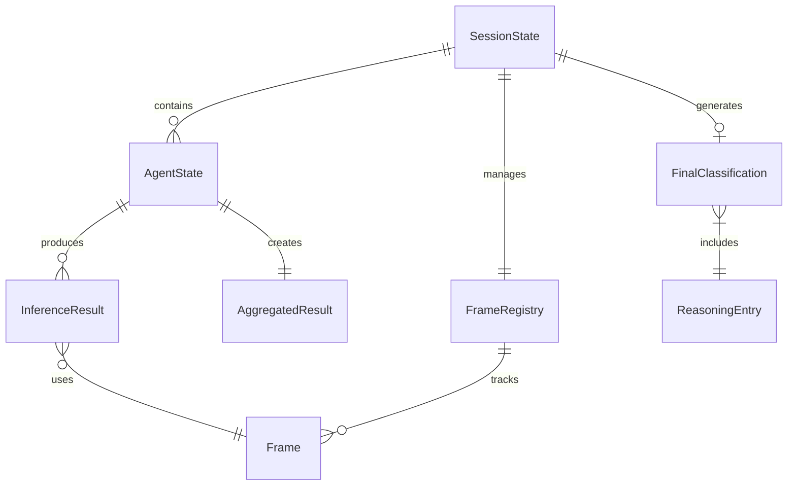

# Data Model Specification

**Feature**: Stateful Agent Orchestration with Multi-Image Inference  
**Version**: 2.0.0  
**Date**: 2025-09-11

## Core Entities

### 1. AgentState
Represents the current state of an individual agent during processing.

```python
class AgentState:
    agent_name: str                    # "initial_classifier", "detail_extractor", etc.
    status: AgentStatus                # IDLE, RUNNING, PAUSED, COMPLETED, ERROR
    timer_seconds: float               # Configured timer duration (e.g., 4.0)
    timer_remaining: float             # Seconds remaining on timer
    timer_started_at: Optional[float]  # Unix timestamp when timer started
    
    # Inference tracking
    inference_count: int               # Number of inferences completed
    current_inference_num: int         # Current inference in progress (1-based)
    frames_collected: List[str]        # Frame IDs collected for next inference
    
    # Results
    inference_results: List[InferenceResult]  # All inference results
    finalized_attributes: Dict[str, Any]      # Aggregated final attributes
    aggregation_method: str            # "majority", "last_with_fallback", etc.
    
    # State persistence
    created_at: datetime
    updated_at: datetime
    checkpointed_at: Optional[datetime]

class AgentStatus(Enum):
    IDLE = "idle"
    RUNNING = "running"
    PAUSED = "paused"
    COMPLETED = "completed"
    ERROR = "error"
```

### 2. InferenceResult
Result from a single inference cycle (single or multi-image).

```python
class InferenceResult:
    inference_id: str                  # Unique identifier
    agent_name: str                    # Which agent produced this
    inference_num: int                 # Sequential number (1, 2, 3...)
    inference_type: str                # "single_image" or "multi_image"
    
    # Frame data
    frame_ids: List[str]               # IDs of frames used
    frame_count: int                   # Number of frames in this inference
    
    # VLM results
    attributes: Dict[str, Any]         # Agent-specific attributes detected
    confidence: float                  # 0.0 to 1.0
    reasoning: str                     # VLM reasoning/explanation
    raw_response: str                  # Complete VLM response
    
    # Timing
    started_at: datetime
    completed_at: datetime
    duration_ms: int                   # Processing time in milliseconds
    
    # Prompt used
    prompt_version: str                # "base" or "multi_angle"
    prompt_text: str                   # Actual prompt sent to VLM
```

### 3. SessionState
Overall session state tracking all agents and orchestration.

```python
class SessionState:
    session_id: str                    # UUID for session
    mode: SessionMode                  # AUTOMATIC or MANUAL
    status: SessionStatus              # ACTIVE, PAUSED, COMPLETED, ERROR
    
    # Agent tracking
    agents_sequence: List[str]         # ["initial", "detail", "damage", "final"]
    current_agent_index: int           # Index in sequence (0-based)
    agents_completed: List[str]        # Completed agent names
    agent_states: Dict[str, AgentState]  # State per agent
    
    # Pause/Resume
    paused_at: Optional[datetime]      # When paused
    paused_agent: Optional[str]        # Which agent was active
    resume_from_agent: Optional[str]   # Agent to resume from
    
    # Frame sharing
    shared_frames: Dict[str, Frame]    # Special frames (e.g., initial's first)
    frame_registry: FrameRegistry      # Frame management
    
    # Results
    final_classification: Optional[FinalClassification]
    
    # Lifecycle
    created_at: datetime
    updated_at: datetime
    completed_at: Optional[datetime]

class SessionMode(Enum):
    AUTOMATIC = "automatic"
    MANUAL = "manual"

class SessionStatus(Enum):
    ACTIVE = "active"
    PAUSED = "paused"
    COMPLETED = "completed"
    ERROR = "error"
```

### 4. Frame
Captured frame with metadata.

```python
class Frame:
    frame_id: str                      # Unique identifier
    session_id: str                    # Associated session
    agent_name: str                    # Agent that captured it
    
    # Frame data
    data: bytes                        # Image bytes (JPEG encoded)
    width: int
    height: int
    format: str                        # "bgr24", "rgb24", etc.
    
    # Metadata
    captured_at: datetime
    frame_number: int                  # Sequential number from stream
    is_shared: bool                    # True if shared between agents
    shared_with: List[str]             # Agent names it's shared with
    
    # Storage
    file_path: Optional[str]           # Debug storage location
```

### 5. AggregatedResult
Result of aggregating multiple inferences for an agent.

```python
class AggregatedResult:
    agent_name: str
    total_inferences: int
    aggregation_method: str            # Method used
    
    # Finalized attributes (agent-specific)
    attributes: Dict[str, Any]
    
    # Aggregation details
    attribute_votes: Dict[str, Dict[str, int]]  # Attribute -> value -> count
    conflicts_resolved: List[ConflictResolution]
    
    # Confidence
    overall_confidence: float
    per_attribute_confidence: Dict[str, float]

class ConflictResolution:
    attribute: str
    values_considered: List[Any]
    resolution_method: str             # "majority", "last_with_fallback", "single"
    final_value: Any
    reason: str
    
    # Detailed resolution rules:
    # 1 inference: Use as-is (resolution_method="single")
    # 2 inferences: 
    #   - If second has value: use second
    #   - If second is null & first has value: use first
    #   - If both null: keep null
    #   (resolution_method="last_with_fallback")
    # 3+ inferences: Most frequent value (resolution_method="majority")
```

### 6. FinalClassification
Final compiled result from all agents.

```python
class FinalClassification:
    # Core attributes from all agents
    item_type: str                     # From initial
    color: str                         # From initial
    pattern: Optional[str]             # From initial
    neckline: Optional[str]            # From initial
    sleeve_type: Optional[str]         # From initial
    closure_type: Optional[str]        # From initial
    
    brand: Optional[str]               # From detail
    size: Optional[str]                # From detail
    
    is_damaged: bool                   # From damage
    damage_type: Optional[str]         # From damage
    damage_severity: Optional[str]     # From damage
    
    # Aggregated reasoning
    reasoning_sequence: List[ReasoningEntry]
    
    # Metadata
    overall_confidence: float
    processing_time_ms: int
    total_inferences: int
    agents_used: List[str]

class ReasoningEntry:
    sequence_num: int                  # 1, 2, 3...
    agent_name: str
    inference_num: int
    reasoning_text: str
```

### 7. FrameRegistry
Manages frame lifecycle and sharing.

```python
class FrameRegistry:
    session_id: str
    frames: Dict[str, Frame]           # frame_id -> Frame
    
    # Sharing management
    shared_frames: Dict[str, str]      # "initial_first" -> frame_id
    reference_counts: Dict[str, int]   # frame_id -> ref count
    
    # Methods
    def register_frame(frame: Frame) -> str
    def get_frame(frame_id: str) -> Optional[Frame]
    def share_frame(frame_id: str, share_key: str) -> None
    def get_shared_frame(share_key: str) -> Optional[Frame]
    def release_frame(frame_id: str) -> None
```

## State Transitions

### Agent State Machine
```
IDLE -> RUNNING: Start timer and begin inference
RUNNING -> PAUSED: User pause request (clear current inferences)
RUNNING -> COMPLETED: Timer expired and aggregation done
RUNNING -> ERROR: Inference failure or timeout
PAUSED -> RUNNING: Resume request (restart timer)
ERROR -> IDLE: Reset agent
```

### Session State Machine
```
ACTIVE -> PAUSED: Pause request during agent processing
PAUSED -> ACTIVE: Resume request
ACTIVE -> COMPLETED: All agents finished
ACTIVE -> ERROR: Unrecoverable error
ERROR -> ACTIVE: Retry session
```

## Validation Rules

### AgentState
- timer_seconds must be > 0
- inference_count >= 0
- current_inference_num <= inference_count + 1
- frames_collected length <= 5 (max batch size)
- timer_remaining <= timer_seconds

### InferenceResult
- inference_num must be sequential (no gaps)
- frame_count must match len(frame_ids)
- confidence must be 0.0 <= x <= 1.0
- duration_ms must be > 0
- inference_type matches frame_count (1 = single, >1 = multi)

### SessionState
- current_agent_index < len(agents_sequence)
- agents_completed subset of agents_sequence
- paused_agent must be in agents_sequence
- shared_frames keys must be predefined ("initial_first", etc.)

### Frame
- frame_id must be unique per session
- data size must be > 0
- width, height must be > 0
- is_shared implies len(shared_with) > 0

## Relationships



## Persistence Strategy

### In-Memory Primary Storage
- All active session states kept in memory
- Fast access for real-time processing
- No I/O blocking during inference

### JSON Checkpointing
- Async snapshots every state change
- Files: `/sessions/{session_id}/state.json`
- Enables crash recovery
- Human-readable for debugging

### Frame Storage
- Frames saved to: `/sessions/{session_id}/frames/{frame_id}.jpg`
- Only for debugging (captured_frames directory)
- Automatic cleanup after session complete + 24h

## Migration from V1

### Breaking Changes
1. AgentState replaces simple agent status tracking
2. InferenceResult replaces single result per agent
3. Frame management now explicit (was implicit)
4. Aggregation methods now configurable

### Data Migration
```python
def migrate_v1_to_v2(v1_session):
    v2_session = SessionState(
        session_id=v1_session.session_id,
        mode=SessionMode.AUTOMATIC,  # V1 only had auto
        agents_sequence=["initial", "detail", "damage", "final"],
        # Map V1 results to single inference per agent
        agent_states={
            agent: AgentState(
                agent_name=agent,
                status=AgentStatus.COMPLETED,
                inference_results=[map_v1_result(result)]
            )
            for agent, result in v1_session.results.items()
        }
    )
    return v2_session
```

## Performance Considerations

### Memory Usage
- AgentState: ~2KB per agent
- InferenceResult: ~5KB per inference
- Frame metadata: ~1KB (data stored separately)
- SessionState: ~20KB for typical session
- Total per session: <100KB metadata + frame data

### Access Patterns
- Frequent reads: current agent state, timer remaining
- Frequent writes: inference results, frame registry
- Optimize: Keep active agent state in local cache
- Index by: session_id, agent_name, frame_id

### Cleanup Policy
- Completed sessions: Archive after 1 hour
- Errored sessions: Retain for 24 hours
- Frames: Delete after session archived
- Logs: Rotate daily, keep 7 days